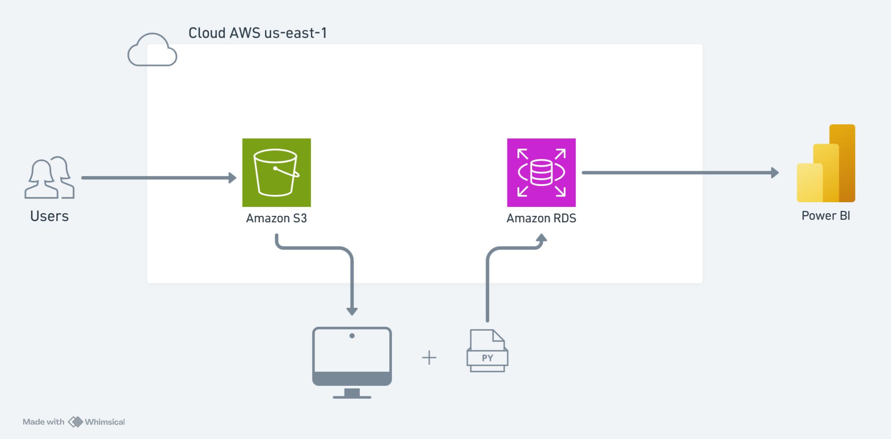

# RetainIQ

O **RetainIQ** é um projeto de engenharia e análise de dados que simula um pipeline real de uma instituição financeira. A partir de dados de clientes bancários, o projeto realiza a ingestão, tratamento e visualização das principais métricas relacionadas ao **churn** — o cancelamento de contas por parte dos clientes.

O objetivo é demonstrar a construção de uma arquitetura de dados estruturada na nuvem AWS, com foco em boas práticas de segurança, custo e operação.

---

## 🏗️ Arquitetura



O pipeline segue o seguinte fluxo:

1. O dataset é carregado no **Amazon S3** como camada raw
2. Um script Python lê o arquivo do S3, aplica os tratamentos necessários e carrega no banco de dados
3. O **Amazon RDS (PostgreSQL)** armazena os dados tratados em formato relacional
4. O **Power BI** conecta diretamente no RDS e gera os dashboards analíticos

---

## 🗂️ Dataset

- **Nome:** Bank Customers Churn (Churn Modeling)
- **Fonte:** [Kaggle](https://www.kaggle.com/)
- **Volume:** 10.000 registros
- **Descrição:** Dataset contendo informações de clientes bancários, incluindo perfil demográfico, comportamento financeiro e indicador de churn.

### Tratamentos aplicados
- Renomeação de colunas para padrão `snake_case`
- Conversão das colunas `has_cr_card`, `is_active_member` e `exited` de inteiro (0/1) para booleano
- Substituição de sobrenomes com caracteres corrompidos (problema de encoding) por `NULL`

---

## 🛠️ Stack Tecnológica

| Camada | Tecnologia |
|---|---|
| Armazenamento raw | Amazon S3 |
| Extração e carga | Python, Pandas, boto3, SQLAlchemy |
| Banco de dados | Amazon RDS (PostgreSQL 18) |
| Autenticação | AWS IAM |
| Visualização | Power BI |

---

## 📁 Estrutura do Repositório

```
RetainIQ/
│
├── arquitetura/
│   └── arquitetura-RetainIQ.png  # diagrama da arquitetura
│
├── python/
│   ├── analise_exploratoria.py   # exploração inicial do dataset
│   └── etl.py                    # pipeline de extração e carga
│
├── sql/
│   ├── criacao_tabela.sql        # DDL da tabela customers
│   └── queries.sql               # queries analíticas
│
├── .env.example                  # variáveis de ambiente necessárias
├── .gitignore
└── README.md
```

---

## 🔐 Segurança e Boas Práticas

Este projeto foi estruturado seguindo os pilares do **AWS Well-Architected Framework**, com ênfase em:

### IAM — Princípio do Menor Privilégio
Foram criados dois usuários IAM com permissões mínimas e separadas por responsabilidade:

- **etl-usuario** — permissão exclusiva de leitura no S3 (`s3:GetObject`). Utilizado pelo script Python.
- **analytics-usuario** — permissão exclusiva de leitura no RDS. Utilizado para conexão com o Power BI.

A conta root não é utilizada para operações do dia a dia e possui MFA ativo.

### Credenciais
As credenciais AWS nunca são expostas no código. São gerenciadas via arquivo `.env`, incluído no `.gitignore`. O repositório contém apenas um `.env.example` com as variáveis necessárias, sem valores reais.

### Acesso ao RDS
O Security Group da instância RDS permite conexão apenas pelo IP autorizado na porta `5432`, bloqueando qualquer acesso externo não autorizado. A conexão exige SSL obrigatoriamente.

---

## 💰 Otimização de Custos

O projeto foi desenhado para operar dentro do **AWS Free Tier**:

| Serviço | Uso | Limite gratuito |
|---|---|---|
| S3 | Armazenamento do CSV raw | 5GB por 12 meses |
| RDS db.t4g.micro | Banco PostgreSQL | 750h/mês por 12 meses |
| IAM | Controle de acesso | Sempre gratuito |

---

## 🏛️ Well-Architected Framework

| Pilar | Aplicação no Projeto |
|---|---|
| Excelência Operacional | Documentação detalhada, scripts versionados no GitHub |
| Segurança | IAM com menor privilégio, credenciais via `.env`, Security Group restritivo, SSL obrigatório, MFA na root |
| Confiabilidade | RDS gerenciado com backups automáticos pela AWS |
| Eficiência de Performance | Instância dimensionada ao workload, serviços gerenciados |
| Otimização de Custos | Projeto inteiramente dentro do free tier, sem over-provisioning |
| Sustentabilidade | Instâncias mínimas, serviços gerenciados com infraestrutura compartilhada otimizada pela AWS |

---

## 👩‍💻 Autora

- [@larizzzer](https://www.github.com/larizzzer)
