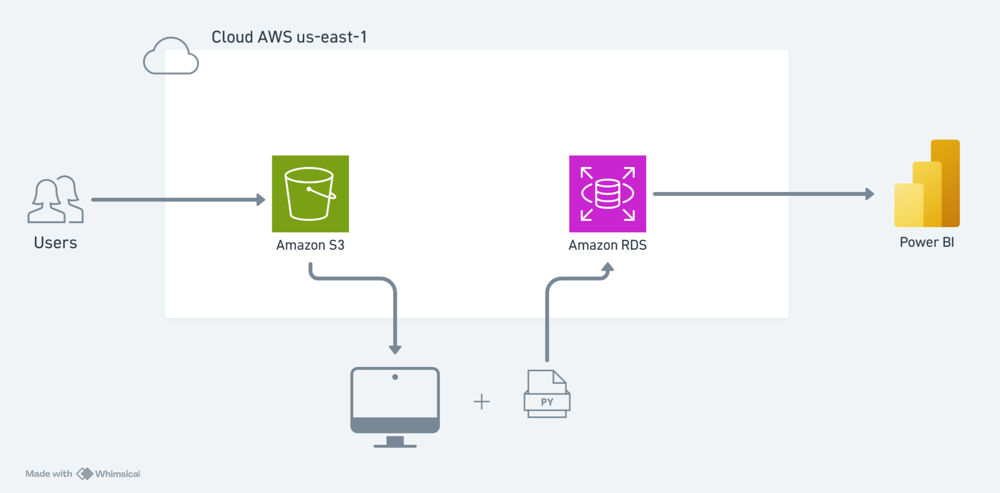

# RetainIQ

O **RetainIQ** é um projeto de engenharia e análise de dados que simula um pipeline real de uma instituição financeira. A partir de um dataset de clientes bancários, o projeto trata a ingestão, tratamento e visualização das principais métricas relacionadas ao **churn** — o cancelamento de contas por parte dos clientes.

A implementação foi executada até a camada de dados (S3 → Python/ETL → RDS PostgreSQL) — as etapas de ingestão e tratamento rodaram de fato na AWS. A conexão do **Power BI** ao RDS, porém, não foi concluída: a integração externa ao ecossistema AWS (autenticação/driver) se mostrou mais custosa de resolver do que o esperado, e nesse momento a prioridade passou a ser outros estudos. A partir dessa etapa, o restante do projeto (visualização e refinamentos) segue **documentado como arquitetura planejada**, com as decisões técnicas e suas justificativas descritas abaixo.

---

## 🏗️ Arquitetura



O pipeline segue o seguinte fluxo:

1. ✅ O dataset foi carregado no **Amazon S3** como camada raw
2. ✅ Um script Python leu o arquivo do S3, aplicou os tratamentos necessários e carregou no banco de dados
3. ✅ O **Amazon RDS (PostgreSQL)** armazenou os dados tratados em formato relacional
4. 🚧 O **Power BI** se conectaria diretamente ao RDS para gerar os dashboards analíticos — etapa não concluída (ver [Status do Projeto](#-status-do-projeto))

### Por que essa arquitetura?

- **S3 como camada raw**: armazenamento barato, durável e desacoplado do processamento, permitindo reprocessar os dados originais a qualquer momento sem risco de perda.
- **Python + Pandas + boto3 + SQLAlchemy para ETL**: stack leve, amplamente documentada e suficiente para o volume de dados do projeto, sem a necessidade de ferramentas de orquestração mais pesadas.
- **RDS PostgreSQL**: banco relacional gerenciado, que elimina a necessidade de administrar infraestrutura de banco manualmente e já entrega backups automáticos.
- **Power BI conectado direto ao RDS**: evita a duplicação de dados em uma camada intermediária de BI, mantendo os dashboards sempre atualizados com a fonte tratada.
- **IAM com menor privilégio**: separação de responsabilidades entre quem escreve (ETL) e quem lê (analytics) reduz a superfície de risco em caso de vazamento de credenciais.

---

## 🗂️ Dataset

- **Nome:** Bank Customers Churn (Churn Modeling)
- **Fonte:** [Kaggle](https://www.kaggle.com/)
- **Volume:** 10.000 registros
- **Descrição:** Dataset contendo informações de clientes bancários, incluindo perfil demográfico, comportamento financeiro e indicador de churn.

### Tratamentos planejados
- Renomeação de colunas para padrão `snake_case`
- Conversão das colunas `has_cr_card`, `is_active_member` e `exited` de inteiro (0/1) para booleano
- Substituição de sobrenomes com caracteres corrompidos (problema de encoding) por `NULL`

---

## 🛠️ Stack Tecnológica Planejada

| Camada | Tecnologia |
|---|---|
| Armazenamento raw | Amazon S3 |
| Extração e carga | Python, Pandas, boto3, SQLAlchemy |
| Banco de dados | Amazon RDS (PostgreSQL 18) |
| Autenticação | AWS IAM |
| Visualização | Power BI |

---

## 📁 Estrutura do Repositório (planejada)

```
RetainIQ/
│
├── arquitetura/
│   └── arquitetura-RetainIQ.png  # diagrama da arquitetura proposta
│
├── python/
│   ├── analise_exploratoria.py   # exploração inicial do dataset
│   └── etl.py                    # pipeline de extração e carga (planejado)
│
├── sql/
│   ├── criacao_tabela.sql        # DDL da tabela customers
│   └── queries.sql               # queries analíticas
│
├── .env.example                  # variáveis de ambiente necessárias
├── .gitignore
└── README.md
```

---

## 🔐 Segurança e Boas Práticas (previstas)

O planejamento segue os pilares do **AWS Well-Architected Framework**, com ênfase em:

### IAM — Princípio do Menor Privilégio
A proposta prevê dois usuários IAM com permissões mínimas e separadas por responsabilidade:

- **etl-usuario** — permissão exclusiva de leitura no S3 (`s3:GetObject`), para uso pelo script Python.
- **analytics-usuario** — permissão exclusiva de leitura no RDS, para conexão com o Power BI.

A conta root não seria utilizada para operações do dia a dia e teria MFA ativo.

### Credenciais
As credenciais AWS nunca seriam expostas no código. Seriam gerenciadas via arquivo `.env`, incluído no `.gitignore`. O repositório conteria apenas um `.env.example` com as variáveis necessárias, sem valores reais.

### Acesso ao RDS
O Security Group da instância RDS permitiria conexão apenas pelo IP autorizado na porta `5432`, bloqueando qualquer acesso externo não autorizado, com SSL obrigatório.

---

## 💰 Otimização de Custos

O projeto foi desenhado para operar dentro do **AWS Free Tier**:

| Serviço | Uso previsto | Limite gratuito |
|---|---|---|
| S3 | Armazenamento do CSV raw | 5GB por 12 meses |
| RDS db.t4g.micro | Banco PostgreSQL | 750h/mês por 12 meses |
| IAM | Controle de acesso | Sempre gratuito |

---

## 🏛️ Well-Architected Framework

| Pilar | Aplicação planejada no Projeto |
|---|---|
| Excelência Operacional | Documentação detalhada, scripts versionados no GitHub |
| Segurança | IAM com menor privilégio, credenciais via `.env`, Security Group restritivo, SSL obrigatório, MFA na root |
| Confiabilidade | RDS gerenciado com backups automáticos pela AWS |
| Eficiência de Performance | Instância dimensionada ao workload, serviços gerenciados |
| Otimização de Custos | Projeto inteiramente dentro do free tier, sem over-provisioning |
| Sustentabilidade | Instâncias mínimas, serviços gerenciados com infraestrutura compartilhada otimizada pela AWS |

---

## 🚧 Status do Projeto

A camada de dados (S3, ETL em Python e carga no RDS) foi implementada e executada na AWS. Na etapa de conectar o Power BI ao RDS, a autenticação/driver de integração externa não foi resolvida a tempo — a AWS favorece naturalmente ferramentas do próprio ecossistema (como o QuickSight), o que tornou essa integração mais trabalhosa do que o previsto. Diante disso, e com a necessidade de priorizar outros estudos, decidiu-se pausar o projeto nesse ponto e manter o restante (visualização e ajustes finais) **documentado como arquitetura planejada**, preservando as decisões técnicas e suas justificativas.

A conta AWS utilizada no projeto foi posteriormente encerrada; o que permanece disponível neste repositório é o código, a documentação e o diagrama de arquitetura.

---

## 👩‍💻 Autora

- [@larizzzer](https://www.github.com/larizzzer)
